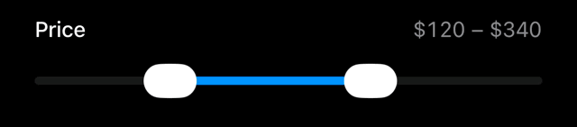
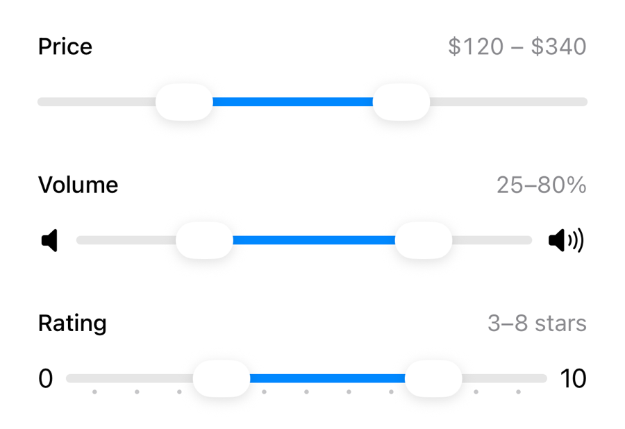
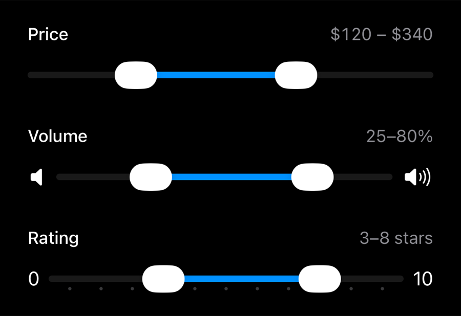

# RangeSlider

A SwiftUI range slider for iOS 26+ that looks and feels like the system `Slider` — same track metrics, ticks, value labels, tint behavior, and a Liquid Glass thumb that morphs into clear glass while dragging.

SwiftUI (and UIKit) only ship a single-thumb slider. `RangeSlider` fills that gap with two thumbs for selecting a closed range.



| Light | Dark |
| --- | --- |
|  |  |

## Requirements

- iOS 26.0+
- Swift 6.2+ / Xcode 26+

## Installation

Add the package to your project with Swift Package Manager:

```swift
dependencies: [
    .package(url: "https://github.com/sallar/swiftui-range-slider.git", from: "1.0.0")
]
```

Then add `RangeSlider` as a dependency of your target.

## Usage

```swift
import SwiftUI
import RangeSlider

struct ContentView: View {
    @State private var range = 0.2...0.8

    var body: some View {
        RangeSlider(range: $range)
    }
}
```

With custom bounds, stepping, and an editing callback:

```swift
RangeSlider(range: $priceRange, in: 0...500, step: 10) { editing in
    print(editing ? "began editing" : "ended editing")
}
```

### Tick marks

The initializers mirror `Slider`, so ticks are described the same way — with
SwiftUI's own `SliderTick`. Pass a `tick` closure to mark step values:

```swift
RangeSlider(range: $rating, in: 0...10, step: 1, tick: { SliderTick($0) })
```

Or list the ticks yourself, with or without a step:

```swift
RangeSlider(range: $range, in: 0...1) {
    SliderTick(0.25)
    SliderTick(0.5)
    SliderTick(0.75)
}
```

Ticks constrain the values the thumbs can take: a slider with ticks only comes
to rest on one of them, the same way the system control behaves.

### Minimum and maximum value labels

```swift
RangeSlider(
    range: $volume,
    in: 0...10,
    minimumValueLabel: { Image(systemName: "speaker.fill") },
    maximumValueLabel: { Image(systemName: "speaker.wave.3.fill") }
)
```

A `label` may also be passed, in the same position as on `Slider`. As on the
system slider on iOS it is not drawn; it names the control for VoiceOver.

### Tint

The slider follows the environment's tint:

```swift
RangeSlider(range: $range)
    .tint(.orange)
```

## Behavior

- Dragging anywhere on the track grabs the nearest thumb; when the thumbs overlap, the first direction of movement decides which one moves.
- Thumbs clamp against each other — the lower bound can never exceed the upper bound.
- Both thumbs are individually accessible with VoiceOver adjustable actions, stepping tick by tick where there are ticks.

## License

[MIT](LICENSE)
