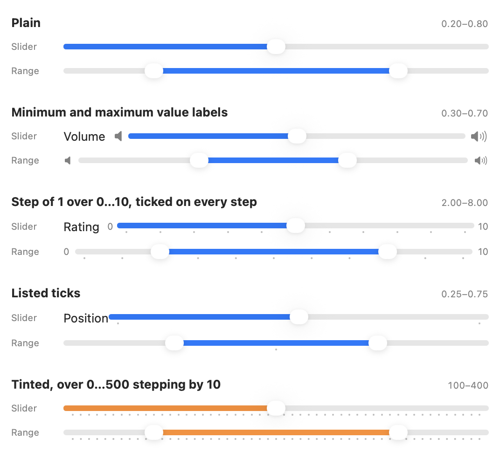
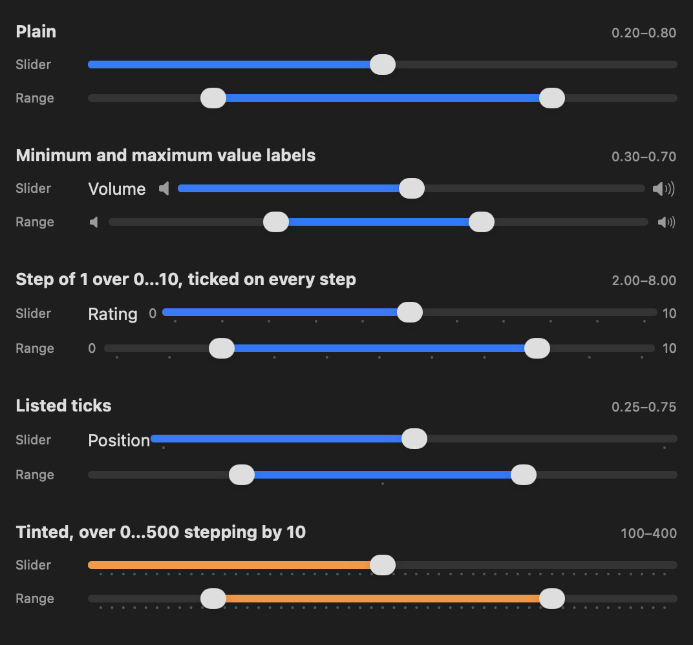

# RangeSlider

A SwiftUI range slider that looks and feels like the system `Slider` on the OS it is running on — same metrics, ticks, value labels, tint behavior, and the same Liquid Glass thumb that turns clear while you drag it on iOS 26 and macOS 26. On iOS 18 it wears that OS's own look instead, down to the gray of the track and the shadow under the knob.

SwiftUI (and UIKit, and AppKit) only ship a single-thumb slider. `RangeSlider` fills that gap with two thumbs for selecting a closed range.


### iOS

| Light | Dark |
| --- | --- |
|  |  |

### macOS

The example app puts the system `Slider` directly above a `RangeSlider` in every configuration:

| Light | Dark |
| --- | --- |
|  |  |

## Requirements

- iOS 18.0+ or macOS 26.0+
- Swift 6.2+ / Xcode 26+

On iOS 26 the control wears Liquid Glass; on iOS 18 it wears the look that OS
draws its own slider with — an opaque knob on a thin track, no growth under the
finger, no glass. The initializers that take ticks are the one exception to the
iOS 18 floor: they are gated on iOS 26, which is the SDK that introduced
`SliderTick`, and where the system slider first drew ticks at all.

The package can be added to a macOS 15 target; the control is gated on macOS 26.

## Installation

Add the package to your project with Swift Package Manager:

```swift
dependencies: [
    .package(url: "https://github.com/sallar/swiftui-range-slider.git", from: "1.0.0")
]
```

Then add `RangeSlider` as a dependency of your target.

## Usage

```swift
import SwiftUI
import RangeSlider

struct ContentView: View {
    @State private var range = 0.2...0.8

    var body: some View {
        RangeSlider(range: $range)
    }
}
```

With custom bounds, stepping, and an editing callback:

```swift
RangeSlider(range: $priceRange, in: 0...500, step: 10) { editing in
    print(editing ? "began editing" : "ended editing")
}
```

### Tick marks

Ticks need iOS 26 or macOS 26: they are described with SwiftUI's own
`SliderTick`, which is the type the system slider gained them with.

The initializers mirror `Slider`, so ticks are described the same way. Pass a
`tick` closure to mark step values:

```swift
RangeSlider(range: $rating, in: 0...10, step: 1, tick: { SliderTick($0) })
```

Or list the ticks yourself, with or without a step:

```swift
RangeSlider(range: $range, in: 0...1) {
    SliderTick(0.25)
    SliderTick(0.5)
    SliderTick(0.75)
}
```

Ticks constrain the values the thumbs can take: a slider with ticks only comes
to rest on one of them, the same way the system control behaves.

### Minimum and maximum value labels

```swift
RangeSlider(
    range: $volume,
    in: 0...10,
    minimumValueLabel: { Image(systemName: "speaker.fill") },
    maximumValueLabel: { Image(systemName: "speaker.wave.3.fill") }
)
```

A `label` may also be passed, in the same position as on `Slider`. It is drawn
ahead of the control on macOS and left undrawn on iOS — on both platforms it
names the control for VoiceOver — which is what the system slider does on each.

### Tint

The slider follows the environment's tint:

```swift
RangeSlider(range: $range)
    .tint(.orange)
```

## Behavior

- Dragging anywhere on the track grabs the nearest thumb; when the thumbs overlap, the first direction of movement decides which one moves.
- On macOS, pressing the track also carries the nearest knob to the pointer, the way every other macOS slider behaves. On iOS a press only picks a thumb up.
- Thumbs clamp against each other — the lower bound can never exceed the upper bound.
- Both thumbs are individually accessible with VoiceOver adjustable actions, stepping tick by tick where there are ticks.

## How each OS is drawn

Everything that differs between platforms and OS versions lives behind a single
internal `RangeSliderStyle`: the metrics, the track, and the thumb. The control
itself only does arithmetic — positions, values, gestures and accessibility — so
a look is a conformance rather than a thicket of `#if` in the middle of the
control. Which platform's slider to imitate is settled when the package is
compiled; which of that platform's looks to wear is settled at runtime, so one
binary built against the iOS 26 SDK draws the right slider on both.

| | iOS 26 | iOS 18 | macOS 26 |
| --- | --- | --- | --- |
| Thumb | 37 × 24 capsule, grows to 56 × 38 under the finger | 27 pt circle, same size held | 20 × 16 capsule, grows to 24 × 20 under the pointer |
| Track | 5.67 pt, stopping short of the ends | 4 pt, reaching the ends | 6 pt |
| Held thumb | clear glass, stretching with the speed of the drag | unchanged | clear glass, no stretch |
| Stepped slider | marked only where ticks are given | never marked, as iOS 18 has no ticks | every step marked, as macOS does |
| Label | undrawn | undrawn | drawn ahead of the control |
| Pressing the track | picks up the nearest thumb | picks up the nearest thumb | carries the nearest knob to the pointer |

The two Liquid Glass looks share one Metal shader, at the size and body their
own control calls for. The iOS 18 look needs none of it: its measurements, its
track gray, and the three-layer shadow under its knob were all read off the
system slider at 3× and reproduced.

## Example app

`Example/RangeSliderExample.xcodeproj` is a single multiplatform app that runs on
both macOS and iOS and puts the system `Slider` next to a `RangeSlider` in every
configuration the package supports, with an appearance picker and a toggle that
outlines what each control claims in the layout.

## License

[MIT](LICENSE)
